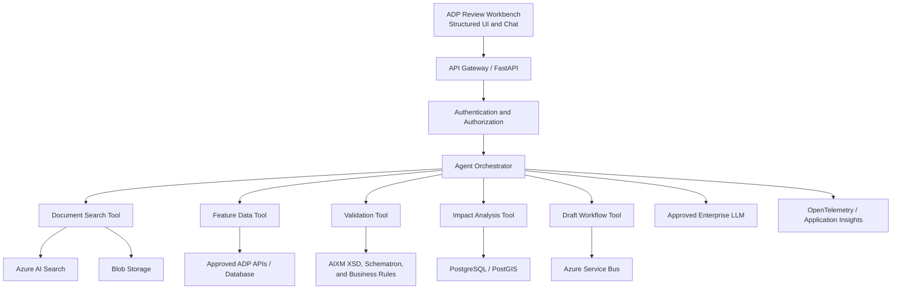
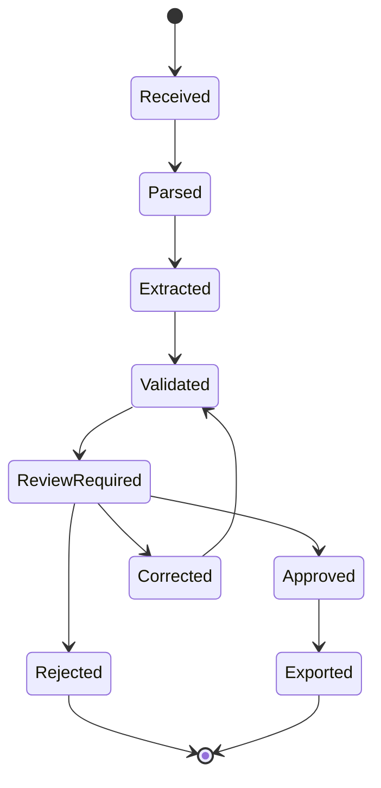

# Agentic AI Design for Aeronautical Data Production

## Interview Pitch

### 60-second pitch

Aeronautical Data Production teams process source material such as AIP amendments, supplements, NOTAM, and standards documents. This work requires specialists to identify changes, compare them with approved data, validate effective dates and aeronautical relationships, assess downstream impact, and preserve traceability.

I propose an **Aeronautical Data Change-Impact and Validation Copilot**. It ingests authorized source documents, extracts candidate changes into a strict schema, compares them with the approved aeronautical database, runs deterministic AIXM, temporal, and geospatial validations, and presents a cited draft to a human reviewer.

The LLM is used for language understanding, extraction, orchestration, and explanation. Deterministic services perform calculations and validation. The agent cannot publish data autonomously, and the existing approved production system remains the system of record.

The user experience is a structured ADP review workbench with a contextual chatbot. Python and FastAPI provide the backend, Azure AI Search provides hybrid retrieval, PostgreSQL/PostGIS supports structured and geospatial data, Azure Service Bus handles durable asynchronous work, and every decision is observable and auditable.

## 1. Problem Statement

An ADP specialist may need to perform the following work when a new source document arrives:

1. Find relevant changes within a large document.
2. Determine which aeronautical features are affected.
3. Compare new values with currently approved values.
4. Verify units, identifiers, coordinates, dates, and relationships.
5. Determine the appropriate AIRAC applicability.
6. Find dependent procedures, charts, routes, or other products.
7. Enter the changes into a production workflow.
8. Provide evidence to a second reviewer.

This process is safety-sensitive, time-consuming, and vulnerable to missed changes or transcription errors.

## 2. Proposed Use Case

When a new AIP amendment, supplement, NOTAM, or related source document arrives, the agent:

1. Classifies the document and determines its version and effective date.
2. Identifies sections containing aeronautical changes.
3. Extracts candidate changes into a typed data contract.
4. Retrieves the corresponding approved records.
5. Shows an old-versus-new comparison.
6. Runs deterministic validation.
7. Finds potentially affected dependent features and products.
8. Attaches page- and section-level source evidence.
9. Creates a draft review item.
10. Waits for a qualified human to approve, correct, or reject it.

The agent is a **copilot for the data producer**, not an autonomous publisher or flight-planning authority.

## 3. Concrete Example

### Existing approved data

```text
Aerodrome:       VOBL
Runway:          09L/27R
TORA:            4000 M
Status:          Available
```

### New source document

```text
Effective 01 October 2026:

Due to a displaced-threshold amendment, runway 09L TORA is
reduced from 4000 metres to 3970 metres. Threshold coordinates
are amended as follows: ...
```

### Agent output

```text
Detected change
────────────────────────────────────────────────────────
Feature:             Runway 09L
Aerodrome:           VOBL
Attribute:           TORA
Approved value:      4000 M
Proposed value:      3970 M
Effective date:      01 October 2026
Source:              AIP Amendment 08/2026
Page and section:    Page 142, AD 2.12
Extraction confidence: 96%

Potentially affected products:
- Declared-distance table
- Aerodrome chart
- Procedures referencing runway 09L
- Flight-planning data

Validation:
✓ Aerodrome and runway exist
✓ Unit is permitted
✓ Proposed TORA does not exceed runway length
✓ Effective date is recognized
⚠ Threshold-coordinate change requires human verification
```

The specialist reviews the source and proposal side by side, then selects **Approve**, **Correct**, or **Reject**.

## 4. User Experience

A pure chatbot is not sufficient for production work. The primary interface is a structured review workbench, with chat available inside the current work-item context.

```text
┌──────────────────────────────────────────────────────────────┐
│ Work item: AIP Amendment 08/2026                  VALIDATED │
├────────────────────────────┬─────────────────────────────────┤
│ Source document            │ Proposed change                 │
│                            │                                 │
│ Page 142, AD 2.12          │ Runway: VOBL 09L               │
│                            │ TORA: 4000 M → 3970 M           │
│ “TORA is reduced...”       │ Effective: 01-Oct-2026         │
├────────────────────────────┴─────────────────────────────────┤
│ Validation                                                   │
│ ✓ Feature exists                                             │
│ ✓ Unit and range valid                                       │
│ ⚠ Coordinate verification required                           │
├──────────────────────────────────────────────────────────────┤
│ [Approve] [Correct] [Reject] [Request Information]           │
├──────────────────────────────────────────────────────────────┤
│ Ask: [Why was this procedure marked as affected?          ]  │
└──────────────────────────────────────────────────────────────┘
```

### Example chatbot questions

- “Summarize the changes in AIP Amendment 08/2026.”
- “What changed for VOBL?”
- “Compare this amendment with the current approved data.”
- “Show the source for the new TORA value.”
- “Why did this AIXM validation rule fail?”
- “Which procedures reference this NAVAID?”
- “What becomes effective in the next AIRAC cycle?”
- “Create a draft change request for this amendment.”

## 5. High-Level Architecture



### Runtime principle

The LLM does not receive an unrestricted database or shell connection. It can call only narrow, validated tools with typed inputs and outputs.

```text
Understand question
       ↓
Select permitted tools
       ↓
Retrieve evidence and structured data
       ↓
Run deterministic validation
       ↓
Generate an answer with citations and warnings
       ↓
Return to user or request human approval
```

## 6. Chatbot Request Flow

Suppose the user asks:

> Why is the TORA of VOBL runway 09L changing, and which procedures might be affected?

### Step 1: Frontend request

```json
{
  "conversation_id": "conv-123",
  "work_item_id": "AMDT-08-2026",
  "question": "Why is VOBL runway 09L TORA changing?",
  "effective_at": "2026-10-01T00:00:00Z"
}
```

### Step 2: Authorization

The backend verifies:

- The user's identity and role.
- The countries and datasets the user may access.
- Whether the user has read-only, producer, validator, or administrator permissions.
- Whether the requested operation is read-only or creates a draft.

### Step 3: Structured tool plan

```json
{
  "intent": "explain_change",
  "tools": [
    "search_source_documents",
    "get_current_feature",
    "get_proposed_change",
    "find_feature_dependencies"
  ],
  "requires_write": false
}
```

### Step 4: Evidence retrieval

The document-search tool uses metadata-filtered hybrid retrieval to locate the exact source section. It returns the text along with document ID, version, page, section, and access classification.

### Step 5: Structured-data retrieval

The feature-data tool retrieves the approved feature version that is valid for the requested effective time.

### Step 6: Deterministic analysis

Validation and impact tools check units, ranges, temporal applicability, spatial relationships, and feature dependencies.

### Step 7: Grounded response

The LLM explains the collected results without inventing missing evidence:

```text
AIP Amendment 08/2026 changes runway 09L TORA from 4000 M to
3970 M, effective 1 October 2026. The stated reason is a
displaced-threshold amendment.

Potentially affected products include the declared-distance table,
the aerodrome chart, and two procedures referencing runway 09L.
Coordinate verification remains pending.

Source: AIP Amendment 08/2026, AD 2.12, page 142.
```

## 7. Agent Tools

The agent should have a small, explicit set of tools:

```text
search_source_documents()
open_document_page()
get_current_feature()
get_feature_at_effective_time()
get_proposed_change()
compare_feature_versions()
find_feature_dependencies()
run_aixm_validation()
run_temporal_validation()
run_spatial_impact_check()
create_draft_change()
submit_for_human_review()
```

Each tool must define:

- A strict input schema.
- A strict output schema.
- Required authorization.
- Expected errors.
- Whether it has side effects.
- Timeout and retry behavior.
- Audit information.

Production-access tools should initially be read-only.

## 8. LLM and Deterministic Responsibility Boundary

### Appropriate LLM responsibilities

- Understanding natural-language questions.
- Document classification.
- Candidate field extraction.
- Mapping document language to domain concepts.
- Selecting permitted tools.
- Summarizing and explaining results.
- Explaining validation failures.

### Deterministic responsibilities

- Coordinate and reference-system processing.
- Unit conversion.
- Date and temporal calculations.
- Geometry intersection and containment.
- AIXM schema and business-rule validation.
- Dependency lookup.
- Approved version selection.
- Flight-route calculations.
- Authorization and workflow transitions.

### Human responsibilities

- Resolving ambiguous source material.
- Verifying safety-significant changes.
- Correcting extraction errors.
- Approving or rejecting proposed changes.
- Authorizing production publication.

## 9. Data and Retrieval Strategy

The system must not send entire document collections to the LLM. It should retrieve only the evidence needed for the current question.

### Search index metadata

Each indexed passage should include:

```text
document_id
document_type
document_version
state_or_region
aerodrome_identifier
section
page
effective_from
effective_to
ingestion_timestamp
access_classification
source_checksum
```

Hybrid retrieval is preferred because exact identifiers, procedure names, document sections, dates, and codes benefit from keyword search, while descriptive questions benefit from semantic vector search.

The system must apply authorization filters before retrieval, not after generating the answer.

## 10. AIXM and Aeronautical Validation

Support the AIXM version required by actual source and downstream contracts. The latest version should not be adopted solely because it is newer.

Validation should include:

- XSD validation.
- Schematron validation.
- Applicable AIXM business rules.
- Internal ADP business rules.
- Feature-reference integrity.
- Identifier uniqueness.
- Temporality and effective-date validation.
- Coordinate and spatial-reference validation.
- Permitted units and value ranges.
- Cross-feature consistency.
- Old-versus-new comparison.

The approved ADP system remains the authoritative source. Vector search and LLM conversation history are never systems of record.

## 11. Event-Driven Workflow

### Workflow state



### Azure Service Bus

Use Service Bus for durable commands and long-running work:

```text
process-source-document
extract-candidate-changes
validate-change-set
calculate-change-impact
request-human-review
export-approved-draft
```

Recommended messaging patterns:

- Peek-lock and explicit completion.
- Idempotency using `work_item_id + stage + source_version`.
- Dead-letter queues for poison messages.
- Bounded retries with exponential backoff.
- Sessions when updates for the same work item must remain ordered.
- A transactional outbox when database updates and event publication must remain consistent.

### Redis

Use Redis for:

- Short-lived caching.
- Rate limiting.
- Temporary progress state.
- Carefully scoped distributed locks.

Do not use Redis as the authoritative aeronautical-data store.

### Kafka

Kafka is optional. Use it only when an existing enterprise event platform needs to distribute approved ADP events independently to chart production, navigation data, flight planning, audit, analytics, and notifications.

Do not add Kafka to the MVP merely to make the architecture appear more sophisticated.

## 12. Core Technology Stack

| Responsibility | Recommended technology |
|---|---|
| Frontend | Existing Angular/React application |
| Chat streaming | Server-Sent Events or WebSocket |
| Backend API | Python and FastAPI |
| Typed contracts | Pydantic |
| Agent orchestration | Explicit state machine; optional LangGraph inside a worker |
| Durable workflow | Azure Durable Functions or Temporal where appropriate |
| LLM | Approved enterprise model with tool calling and structured output |
| Original documents | Azure Blob Storage with versioning |
| Document extraction | Azure AI Document Intelligence and deterministic XML/PDF parsers |
| Retrieval | Azure AI Search with keyword, vector, and metadata filters |
| Application data | PostgreSQL |
| Geospatial data | PostGIS, Shapely, GeoPandas, and PyProj |
| AIXM processing | `lxml`, XSD, Schematron, and applicable business rules |
| Messaging | Azure Service Bus |
| Cache | Redis when necessary |
| Enterprise event log | Kafka only when organizationally justified |
| Identity | Microsoft Entra ID and managed identities |
| Secrets | Azure Key Vault |
| Observability | OpenTelemetry and Application Insights |
| Testing | pytest plus domain-specific evaluation datasets |
| Deployment | Azure Container Apps, AKS, or the approved internal platform |

## 13. Safety and Security Controls

### Data protection

- Use only authorized and properly licensed ICAO and aeronautical documents.
- Encrypt data in transit and at rest.
- Use private network access where required.
- Store secrets in Key Vault.
- Use managed identities rather than embedded credentials.
- Redact sensitive content from prompts and telemetry.

### Agent controls

- Permit only allowlisted tools.
- Apply authorization inside every tool.
- Treat retrieved document content as untrusted data, not instructions.
- Require structured model output.
- Validate all tool arguments.
- Apply time, token, tool-call, and retry limits.
- Require human approval for mutations and publication.
- Record the model, prompt version, sources, tool calls, and outputs.

### Operational boundary

The agent may recommend or create a draft. It must not independently certify, publish, or operationally authorize safety-significant aeronautical data.

## 14. Reliability Strategy

Agent and message execution should assume at-least-once processing.

```text
Receive message
      ↓
Check idempotency key
      ↓
Process and validate
      ↓
Atomically save result and processed-event record
      ↓
Acknowledge message
```

Additional controls:

- Retry only transient failures.
- Dead-letter permanent or repeatedly failing messages.
- Never acknowledge before durable result storage.
- Make tools idempotent where possible.
- Use correlation IDs across UI, API, broker, agent, and tools.
- Store checkpoints for resumable workflows.
- Return “insufficient evidence” rather than guessing.

## 15. Evaluation Strategy

Before building the model workflow, create a golden dataset from historical ADP work items.

### Offline evaluation

- Document retrieval recall.
- Field-level extraction precision and recall.
- Old-versus-new comparison accuracy.
- Effective-date accuracy.
- Citation correctness.
- Validation-rule coverage.
- Dependency-impact recall.
- Hallucination and unsupported-claim rate.

### Workflow evaluation

- Human acceptance rate.
- Human correction rate by field.
- Missed-change rate.
- Incorrect-change rate.
- Review time saved.
- Retry and dead-letter frequency.
- End-to-end latency and cost.
- Unauthorized-action rate, with a target of zero.

### Release gate

A new model, prompt, retrieval configuration, or tool version is released only after it passes the same regression dataset and safety tests.

## 16. MVP Plan

### Phase 1: Discovery and evaluation data

1. Interview data producers and validators.
2. Select one repetitive, bounded scenario such as runway or NAVAID amendments.
3. Collect historical source documents and their approved results.
4. Remove or protect sensitive information.
5. Create a golden test dataset.

### Phase 2: Read-only assistant

1. Ingest and index authorized documents.
2. Build cited document search.
3. Add read-only access to approved feature data.
4. Support summary, source, comparison, and validation-explanation questions.

### Phase 3: Change-extraction copilot

1. Extract structured candidate changes.
2. Run deterministic validations.
3. Add old-versus-new comparison.
4. Add dependency-impact analysis.
5. Present the result in a human review screen.

### Phase 4: Controlled workflow integration

1. Allow creation of draft changes.
2. Add Service Bus for long-running stages.
3. Add approval and correction states.
4. Integrate with the existing approved production workflow.
5. Keep autonomous publication disabled.

### Phase 5: Route-impact explanation

After the ADP use case is proven, add a read-only assistant that explains how approved, effective aeronautical changes may affect a proposed route. Deterministic flight-planning and geospatial engines remain authoritative.

## 17. Design Trade-offs

### Why not begin with autonomous flight planning?

Operational flight planning requires more than ICAO documents. It depends on current approved aeronautical data, aircraft performance, weather, company policy, operational restrictions, and ATC constraints. The cost of an incorrect answer is high.

### Why not use only a vector database?

Vector retrieval is useful for semantic document search but is not authoritative for coordinates, dates, identifiers, versions, relationships, or spatial calculations. Those belong in structured systems and deterministic services.

### Why not use only a chatbot?

Production review requires structured comparisons, warnings, corrections, approvals, and audit history. Chat is useful for investigation and explanation but not as the sole production interface.

### Why not start with multiple agents?

A single constrained orchestrator with explicit tools is easier to evaluate, secure, and audit. Sub-agents should be introduced only when independent bounded work demonstrates a measurable benefit.

### Why use event-driven processing?

Large documents and impact analysis can take longer than an HTTP request. Durable messaging allows work to be retried, resumed, scaled, monitored, and dead-lettered without losing the user's request.

## 18. Five-minute Interview Narrative

1. **Problem:** ADP specialists manually identify, transcribe, validate, and trace changes across aeronautical source documents and production data.
2. **Use case:** A change-impact and validation copilot prepares a cited draft for human review.
3. **Architecture:** A structured UI and chatbot call a FastAPI backend. A constrained agent retrieves documents and approved data through typed tools, invokes deterministic validation services, and uses an LLM only to extract, orchestrate, and explain.
4. **Data:** Originals are versioned in object storage, documents are retrieved through hybrid search, structured and spatial data live in authoritative databases, and every result includes source provenance and effective time.
5. **Workflow:** Service Bus runs long-lived stages with idempotency, retries, dead-lettering, and human approval.
6. **Safety:** The LLM cannot publish data, perform authoritative calculations, or bypass role-based access. The existing ADP system remains the source of truth.
7. **Evaluation:** Historical approved work items become a golden dataset measuring retrieval, extraction, validation, citations, missed changes, human corrections, latency, and cost.
8. **Rollout:** Start read-only with one bounded feature type, prove value, then add draft creation and broader impact analysis.

## 19. Key Interview Statement

> I am not replacing aeronautical data specialists with an LLM. I am building a controlled agent that retrieves evidence, prepares structured candidate changes, invokes deterministic domain tools, and reduces manual effort while preserving human authority, provenance, effective-time correctness, and auditability.

## 20. References

- [ICAO — Aeronautical Information Management](https://www.icao.int/airnavigation/aeronautical-information-management)
- [AIXM — AIXM 5.2](https://aixm.aero/page/aixm-52)
- [AIXM — Business Rules](https://aixm.aero/page/business-rules)
- [AIXM — Data Verification](https://aixm.aero/page/data-verification)
- [EUROCONTROL — Digital NOTAM Specification](https://ext.eurocontrol.int/aixm_confluence/display/DNOTAM/Digital%2BNOTAM%2BSpecification)
- [Microsoft — Azure AI Search Hybrid Search](https://learn.microsoft.com/en-us/azure/search/hybrid-search-overview)
- [Microsoft — Azure Document Intelligence Layout Model](https://learn.microsoft.com/en-us/azure/ai-services/document-intelligence/prebuilt/layout)
- [Microsoft — Prevent Message Loss and Duplicate Processing in Azure Service Bus](https://learn.microsoft.com/en-us/azure/service-bus-messaging/service-bus-message-loss-and-duplicates)
- [PostGIS — Spatial Data Management](https://postgis.net/docs/en/using_postgis_dbmanagement.html)
