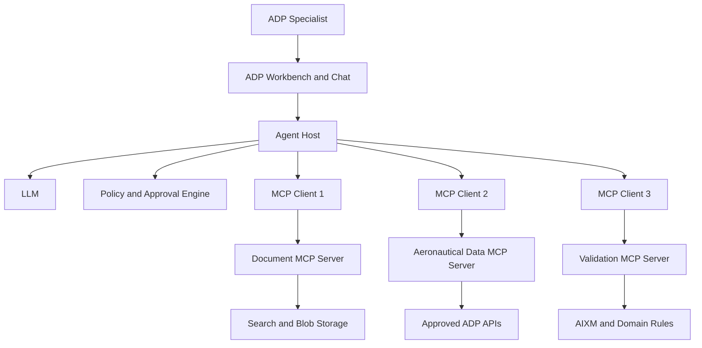
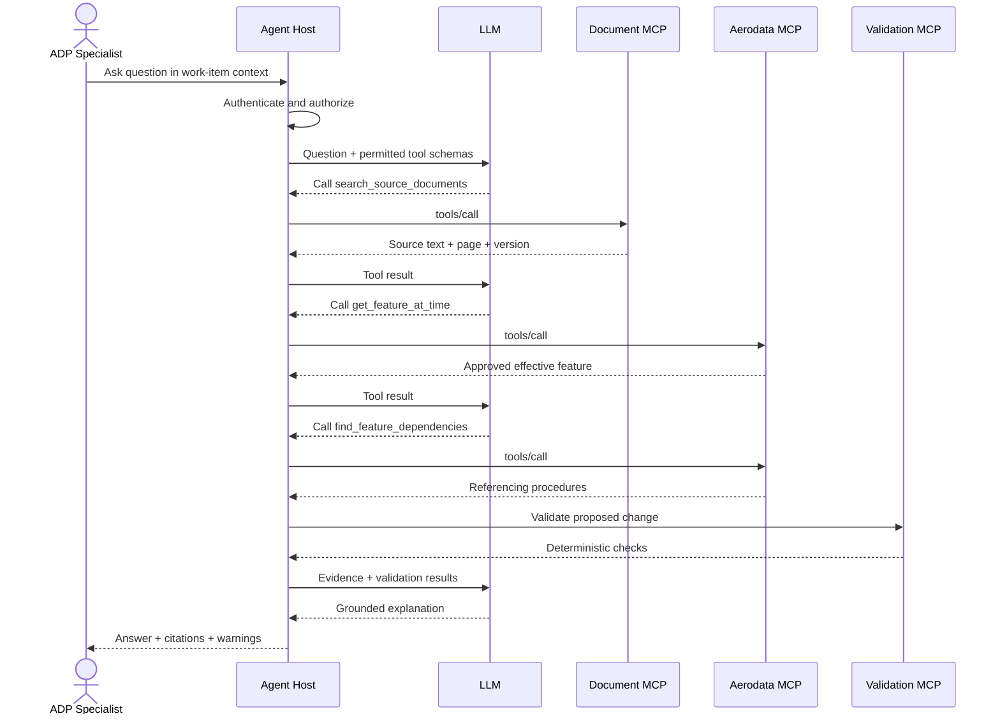

# MCP Foundations for an ADP Agentic AI Interview

This is a self-contained interview reference for explaining Model Context Protocol (MCP), designing MCP servers, and applying them to an Aeronautical Data Production (ADP) agent workflow.

The technical descriptions target MCP protocol revision `2026-07-28`. Older hosts may implement earlier revisions, so production systems must negotiate or explicitly support the versions required by their clients.

## 1. Thirty-Second Definition

> Model Context Protocol is an open, model-independent protocol that standardizes how an AI application discovers and invokes external tools, reads contextual resources, and obtains reusable prompts. The agent host owns the LLM, conversation, orchestration, authorization decisions, and human approvals. MCP servers expose focused domain capabilities through typed contracts. MCP does not replace APIs, databases, message brokers, retrieval systems, or deterministic validation; it provides an agent-facing interoperability layer over them.

## 2. The Mental Model

MCP is comparable to a standard connector:

```text
Without MCP
───────────
Agent A → custom integration → ADP API
Agent B → different integration → ADP API
Agent C → another integration → ADP API

With MCP
────────
Agent A ─┐
Agent B ─┼→ standard MCP contract → ADP MCP server → ADP API
Agent C ─┘
```

MCP separates two concerns:

```text
Agent intelligence and orchestration
                 │
              MCP contract
                 │
Domain data and deterministic capabilities
```

It is more accurate to say **MCP server**, **MCP client**, or **MCP integration** than to refer to individual integrations as “MCPs.”

## 3. What MCP Is and Is Not

### MCP is

- A protocol for AI applications to connect to context and capabilities.
- Model-provider independent.
- Based on JSON-RPC messages and JSON Schema contracts.
- Suitable for local and remote integrations.
- A standard discovery and invocation layer.
- A place to expose narrow, governed domain operations.

### MCP is not

- An LLM.
- An agent or planning algorithm.
- A vector database.
- A RAG implementation.
- A message broker.
- A workflow engine.
- An authorization system by itself.
- A replacement for REST, databases, Service Bus, Kafka, or Redis.
- A guarantee that a tool is safe or that its output is correct.

## 4. Architecture: Host, Client, and Server



### Host

The **host** is the AI application. In this design, it is the FastAPI agent backend serving the ADP workbench.

The host owns:

- The LLM connection.
- System and developer instructions.
- Conversation history.
- Context aggregation.
- The agent loop.
- Tool-selection mediation.
- User consent and approval UI.
- Connections to MCP servers.
- Cross-server orchestration.
- Audit, cost, and observability.

The host is the primary security boundary. A server should not see the entire conversation or data returned by unrelated servers.

### Client

An **MCP client** is a protocol connector created by the host.

It:

- Communicates with one MCP server.
- Sends protocol requests.
- Receives typed results and errors.
- Handles supported protocol versions.
- Supplies credentials and request metadata.
- Maintains isolation between servers.

Conceptually, the host manages one client for each server connection.

### Server

An **MCP server** exposes a focused set of domain capabilities.

It:

- Advertises resources, prompts, and tools.
- Validates arguments.
- Authenticates and authorizes requests.
- Calls downstream APIs or deterministic services.
- Returns structured, bounded results.
- Enforces business rules independently of the LLM.
- Records audit and operational telemetry.

Servers may be local processes or remote services. The current specification describes MCP as a stateless client-host-server protocol with each request carrying its required protocol metadata. [MCP architecture](https://modelcontextprotocol.io/specification/2026-07-28/architecture)

## 5. The Three Primary Server Primitives

### 5.1 Tools

Tools are operations the model may choose to invoke.

Examples:

```text
search_source_documents
get_feature_at_time
compare_feature_versions
find_feature_dependencies
validate_aixm
create_draft_change
```

Tools are described as **model-controlled** because the model may select them based on the conversation. This does not mean the model has final authority. The host and server must still enforce policy, authorization, and approval.

A tool definition includes:

- A stable name.
- A precise description.
- An input JSON Schema.
- An optional output JSON Schema.
- Optional behavioural annotations.
- Optional metadata and icons.

Important annotations include:

```text
readOnlyHint
destructiveHint
idempotentHint
openWorldHint
```

These are hints, not enforceable security policy. A client must not blindly trust annotations received from an untrusted server.

### 5.2 Resources

Resources are identifiable context that an application can retrieve.

Examples:

```text
aip://india/amdt-08-2026/page/142
aixm://feature/runway/VOBL-09L
adp://work-item/AMDT-08-2026
validation://aixm/5.1.1/rule/AIXM-123
```

A resource typically has:

- A URI.
- A name and optional title.
- A MIME type.
- Text or binary content.
- Optional description, size, annotations, and modification time.

Resources are described as **application-controlled** because the host decides which resource content to read or place into model context.

Use resources for stable, addressable content. Use a tool when arguments, authorization, computation, or side effects are required.

### 5.3 Prompts

Prompts are reusable workflow templates selected by the user or application.

Examples:

```text
/analyze-aip-amendment
/explain-validation-error
/compare-airac-cycles
/assess-navaid-impact
```

Prompts are described as **user-controlled** because users commonly select them through slash commands, menus, or buttons.

Example rendered prompt:

```text
Analyze AIP Amendment AMDT-08-2026.

Identify runway-related changes, compare them with the approved
dataset, run deterministic validation, and cite the source page and
section for every candidate value. Report missing evidence instead
of guessing.
```

The official specification identifies prompts, resources, and tools as the fundamental server primitives. [MCP server primitives](https://modelcontextprotocol.io/specification/2026-07-28/server/index)

## 6. How to Choose Between a Tool, Resource, and Prompt

| Requirement | Primitive |
|---|---|
| Read a known document page | Resource |
| Search many documents using arguments | Tool |
| Calculate spatial intersections | Tool |
| Create a draft work item | Tool |
| Offer a reusable “Analyze amendment” workflow | Prompt |
| Expose a stable validation-rule description | Resource |
| Execute validation against supplied content | Tool |

A useful interview rule is:

```text
Resource = noun or addressable context
Tool     = verb or operation
Prompt   = reusable interaction template
```

## 7. Base Protocol

### JSON-RPC message types

MCP uses JSON-RPC-style messages:

1. **Request:** Has an ID and expects a response.
2. **Response:** Has the matching ID and a result.
3. **Error response:** Has the matching ID and a structured error.
4. **Notification:** Has no ID and expects no response.

Example request:

```json
{
  "jsonrpc": "2.0",
  "id": 42,
  "method": "tools/call",
  "params": {
    "name": "adp.get_feature_at_time",
    "arguments": {
      "feature_id": "VOBL-RWY-09L",
      "effective_at": "2026-10-01T00:00:00Z"
    }
  }
}
```

Example successful result:

```json
{
  "jsonrpc": "2.0",
  "id": 42,
  "result": {
    "resultType": "complete",
    "structuredContent": {
      "feature_id": "VOBL-RWY-09L",
      "feature_type": "Runway",
      "valid_from": "2026-10-01T00:00:00Z",
      "status": "APPROVED",
      "attributes": {
        "tora": {
          "value": 4000,
          "unit": "M"
        }
      }
    },
    "isError": false
  }
}
```

### Protocol version and capabilities

Every current request carries protocol version, client information, and client capabilities in request metadata. A client may use `server/discover` to learn server versions and capabilities before another operation.

Capabilities answer questions such as:

- Does the server expose tools?
- Does it expose resources or prompts?
- Does it support list-change notifications?
- Does a particular extension apply?

Never invoke an optional capability that was not declared.

### Discovery operations

Important discovery operations include:

```text
server/discover
tools/list
resources/list
prompts/list
```

Lists may be paginated. In the current protocol, list and resource responses can include cache lifetime and scope so hosts do not repeatedly rebuild unchanged tool catalogs.

## 8. Current `2026-07-28` Protocol Model

Many tutorials still describe the 2025-era protocol. For current interviews, know the following changes:

### Stateless protocol core

- The `initialize`/`initialized` handshake was retired.
- `Mcp-Session-Id` was retired.
- Every request is self-describing.
- Requests can reach any horizontally scaled server instance.
- Application state should be represented using explicit handles rather than hidden protocol sessions.

### Header-based routing

Streamable HTTP requests carry headers such as:

```http
MCP-Protocol-Version: 2026-07-28
Mcp-Method: tools/call
Mcp-Name: adp.get_feature_at_time
```

This allows gateways, WAFs, rate limiters, and authorization infrastructure to route or govern operations without parsing the complete JSON body.

### Multi Round-Trip Requests

When additional user input is required, the server returns an `input_required` result. The client gathers the answer and retries the original request with the supplied input and an opaque request-state value.

### Cacheable lists

Results from operations such as `tools/list` can carry `ttlMs` and `cacheScope`. Deterministic ordering improves prompt-cache reuse.

### Extensions

Long-running Tasks and optional MCP Apps are part of the extension model rather than the minimal protocol core.

### Deprecations

For new designs, do not depend on:

- Roots.
- Sampling through the client.
- Protocol logging.
- Legacy HTTP+SSE transport.

Roots, sampling, and logging remain temporarily available for compatibility but are deprecated. Use explicit resource/tool arguments, direct LLM-provider integration, and OpenTelemetry instead. [MCP 2026-07-28 release](https://blog.modelcontextprotocol.io/posts/2026-07-28/)

## 9. Transports

### Standard input/output (`stdio`)

Use `stdio` when:

- The host launches a local MCP server as a subprocess.
- The server runs on the same machine.
- You are building a CLI, desktop, or local-development integration.

Properties:

- Simple local process isolation.
- JSON messages pass through standard input and output.
- Logs go to standard error, not standard output.
- Credentials are typically supplied through a controlled environment or process configuration.

### Streamable HTTP

Use Streamable HTTP when:

- The MCP server is a shared remote service.
- Multiple hosts or teams consume it.
- Enterprise authentication is required.
- Horizontal scaling, gateways, and centralized observability are needed.

For ADP production servers, Streamable HTTP is usually the appropriate transport.

### Transport-selection answer

> I would use `stdio` for a local prototype or developer utility. I would use Streamable HTTP behind an authenticated API gateway for shared ADP services. Transport selection does not change the domain contracts exposed by the server.

## 10. Tool Design

A good tool is:

- Focused on one business operation.
- Strongly typed.
- Bounded in runtime and output size.
- Explicit about effective time and data version.
- Explicit about read versus write behaviour.
- Idempotent where possible.
- Rich in source provenance.
- Safe when called with incorrect arguments.
- Independently authorized and audited.

### Good tool names

```text
adp.search_source_documents
adp.get_feature_at_time
adp.compare_feature_versions
adp.validate_candidate_change
adp.create_draft_change
```

### Dangerous tool names

```text
query_database
execute_sql
run_any_command
call_url
perform_action
update_record
```

Generic tools expand the model's authority and make authorization, testing, and auditing difficult.

### Example tool contract

```json
{
  "name": "adp.get_feature_at_time",
  "title": "Get Approved Aeronautical Feature",
  "description": "Return the approved version of one aeronautical feature effective at a specified UTC time.",
  "inputSchema": {
    "$schema": "https://json-schema.org/draft/2020-12/schema",
    "type": "object",
    "properties": {
      "feature_id": {
        "type": "string",
        "minLength": 1,
        "description": "Stable aeronautical feature identifier"
      },
      "effective_at": {
        "type": "string",
        "format": "date-time",
        "description": "UTC time used to select the effective feature version"
      }
    },
    "required": ["feature_id", "effective_at"],
    "additionalProperties": false
  },
  "outputSchema": {
    "$schema": "https://json-schema.org/draft/2020-12/schema",
    "type": "object",
    "properties": {
      "feature_id": {"type": "string"},
      "feature_type": {"type": "string"},
      "version": {"type": "string"},
      "valid_from": {"type": "string", "format": "date-time"},
      "valid_to": {
        "anyOf": [
          {"type": "string", "format": "date-time"},
          {"type": "null"}
        ]
      },
      "attributes": {"type": "object"},
      "source_references": {
        "type": "array",
        "items": {"type": "string"}
      }
    },
    "required": [
      "feature_id",
      "feature_type",
      "version",
      "valid_from",
      "attributes",
      "source_references"
    ],
    "additionalProperties": false
  },
  "annotations": {
    "readOnlyHint": true,
    "destructiveHint": false,
    "idempotentHint": true,
    "openWorldHint": false
  }
}
```

The current tool specification supports JSON Schema 2020-12, structured results, resource links, and input-required responses. [MCP tools specification](https://modelcontextprotocol.io/specification/2026-07-28/server/tools)

## 11. Tool Results and Errors

### Successful result

A good result should contain:

- Structured content matching the output schema.
- Human-readable content only when useful.
- Resource links for source material.
- Provenance and version information.
- An explicit completion status.

### Domain/tool execution error

Use a tool execution error when the tool ran but could not complete its business operation:

```json
{
  "isError": true,
  "content": [
    {
      "type": "text",
      "text": "No approved feature version exists at the requested effective time."
    }
  ]
}
```

Examples:

- Feature not found.
- Validation failed.
- Requested date has no approved version.
- Downstream API temporarily unavailable.

Returning a meaningful execution error lets the model correct an argument or explain the failure.

### Protocol error

Use a protocol-level error for malformed JSON-RPC, an unknown method, invalid protocol framing, or another protocol violation.

Do not use protocol errors for ordinary domain failures.

### Error classification

Every server should distinguish:

```text
Validation error   → Caller may correct arguments
Not found          → Caller may search or ask the user
Unauthorized       → Stop or request valid authorization
Forbidden          → Do not retry without changed permissions
Transient failure  → Retry with bounded backoff
Permanent failure  → Return error or dead-letter background job
Conflict           → Re-read current version before retrying
```

## 12. Input Required and Human Interaction

Suppose a write tool needs an AIRAC selection:

```text
Agent calls create_draft_change
              ↓
Server cannot determine applicable AIRAC
              ↓
Server returns resultType: input_required
              ↓
Host displays a form to the user
              ↓
User selects the AIRAC cycle
              ↓
Client retries the original call with inputResponses
```

This mechanism does not eliminate approval policy. The host should still present a clear confirmation before a sensitive operation, and the server must independently authorize it.

Never request passwords, API keys, or other secrets through an elicitation form.

## 13. Long-Running Work and Tasks

Examples of long-running ADP operations include:

- Parsing an entire AIP amendment.
- Comparing country-level datasets.
- Validating a large AIXM package.
- Calculating dependencies across many procedures.

Two valid implementation patterns exist.

### Portable explicit-job pattern

```text
submit_dataset_validation() → job_id
get_validation_status(job_id)
get_validation_result(job_id)
cancel_validation(job_id)
```

This pattern is easy to understand and works even when the host does not support the Tasks extension.

### MCP Tasks extension

When the host and server both support the extension, a tool can use task-based execution with polling and deferred result retrieval.

The backend may still use Azure Service Bus:

```text
MCP tools/call
      ↓
Validation service creates job
      ↓
Azure Service Bus command
      ↓
Worker processes dataset
      ↓
Result saved in PostgreSQL/Blob Storage
      ↓
MCP task/result or status tool returns result
```

MCP provides the agent-facing contract; Service Bus provides durable asynchronous delivery.

## 14. Authorization and Security

### Authentication versus authorization

```text
Authentication → Who is the caller?
Authorization  → What may that caller do to this resource?
Approval       → Does this specific sensitive action have user consent?
```

All three are required for production write operations.

### Remote server authorization

For protected HTTP servers, MCP uses OAuth-based authorization concepts. Important requirements include:

- Protected-resource metadata discovery.
- Authorization-server discovery.
- Access tokens bound to the intended MCP server.
- Bearer tokens in the `Authorization` header.
- PKCE and issuer validation where applicable.
- Least-privilege and incremental scopes.
- No access tokens in query strings.
- No token passthrough to downstream services.

The MCP server validates its inbound token and then uses a separately authorized identity for downstream services.

```text
Host access token for ADP MCP server
                  ✗ do not forward
ADP MCP server's managed identity
                  ✓ use for downstream ADP API
```

The current MCP authorization specification requires resource-specific token validation and prohibits accepting or transiting tokens intended for other resources. [MCP authorization](https://modelcontextprotocol.io/specification/2026-07-28/basic/authorization)

### Example scopes

```text
adp.documents.read
adp.features.read
adp.validation.execute
adp.drafts.create
adp.review.submit
adp.production.publish
```

The chatbot should ordinarily receive the first three. Draft creation is granted only to qualified producers. Production publication should remain outside the autonomous agent flow.

### Authorization must be argument-aware

A user may have permission to read one country or dataset but not another. Checking only the tool name is insufficient.

```python
authorize(
    user=user,
    action="adp.features.read",
    country=request.country,
    dataset=request.dataset_id,
    effective_at=request.effective_at,
)
```

### Prompt-injection boundary

Content retrieved from an AIP, attachment, website, or database is untrusted data. It must not override the host's instructions or permissions.

```text
System policy        → trusted instruction
Tool schema          → trusted contract
Retrieved document  → untrusted evidence
Tool result          → untrusted until validated
```

### Write-operation policy

For every write tool:

- Use a separate authorization scope.
- Require an idempotency key.
- Show the exact proposed change.
- Require confirmation where appropriate.
- Revalidate the current record version.
- Record before and after values.
- Record user, model, source, and tool version.
- Return the created draft identifier.
- Never interpret tool annotations as authorization.

## 15. MCP Server Decomposition for ADP

Start with a few cohesive servers. Do not create one server for every function, and do not create a single unrestricted server for the entire organization.

### 15.1 Document MCP server

Backend systems:

- Azure Blob Storage.
- Azure AI Search.
- Document parsing/OCR service.

Resources:

```text
aip://{state}/{document_id}/page/{page}
icao://{document_id}/{edition}/section/{section}
```

Tools:

```text
search_source_documents
get_document_metadata
find_effective_date
open_document_page
```

Security:

- Document-level permissions.
- Country/dataset filters before retrieval.
- Bounded snippets and page counts.
- Source checksums and version metadata.

### 15.2 Aeronautical Data MCP server

Backend systems:

- Existing approved ADP APIs.
- PostgreSQL/PostGIS read models where authorized.

Resources:

```text
aixm://feature/{feature_id}
adp://dataset/{dataset_id}/version/{version}
```

Tools:

```text
get_feature_at_time
compare_feature_versions
find_feature_dependencies
list_changes_for_airac
find_features_in_area
```

Every query should explicitly identify effective time, dataset version, or both.

### 15.3 Validation MCP server

Backend systems:

- AIXM XSD validation.
- Schematron.
- Applicable AIXM business rules.
- Internal deterministic business rules.
- PostGIS, Shapely, and PyProj.

Tools:

```text
validate_aixm_schema
validate_business_rules
validate_temporality
validate_declared_distances
calculate_spatial_intersections
validate_candidate_change
```

This server should contain deterministic code, not an LLM pretending to be a validator.

### 15.4 Workflow MCP server

Backend systems:

- Production workflow API.
- PostgreSQL.
- Azure Service Bus.

Tools:

```text
create_draft_change
get_work_item_status
add_reviewer_comment
submit_for_human_review
cancel_draft
```

This server has the strictest scopes, approval requirements, idempotency, and auditing.

## 16. ADP Chatbot End-to-End Flow

Question:

> Why is VOBL runway 09L TORA changing, and which procedures might be affected?



### Responsibility breakdown

The LLM:

- Understands the question.
- Selects tools.
- Connects evidence.
- Explains results.

MCP:

- Standardizes discovery and invocation.
- Carries typed arguments and results.
- Preserves boundaries between services.

Domain services:

- Retrieve authoritative data.
- Perform calculations and validation.
- Enforce business rules and permissions.

The human:

- Resolves ambiguity.
- Corrects candidates.
- Approves safety-significant changes.

## 17. MCP Versus Related Technologies

### MCP versus model function calling

Model function calling is a provider-specific interface through which an LLM proposes a tool name and arguments. MCP standardizes tool discovery and invocation outside the model provider.

```text
MCP tools/list
      ↓
Host converts tool definitions to the selected model's tool format
      ↓
Model requests a tool call
      ↓
Host converts it to MCP tools/call
```

They complement each other.

### MCP versus REST

REST exposes application APIs. MCP exposes agent-friendly resources, prompts, and tools, often by wrapping those APIs.

```text
Agent host → MCP server → REST service → database
```

Do not rebuild stable business logic inside an MCP server merely to avoid calling an existing API.

### MCP versus RAG

RAG retrieves relevant evidence for a model. MCP can expose a search tool or document resources, but it does not perform embedding, indexing, ranking, or grounding automatically.

```text
MCP search tool → Azure AI Search → ranked source passages
```

### MCP versus Azure Service Bus

MCP is primarily request/discovery integration. Service Bus provides durable asynchronous delivery, retries, competing consumers, and dead-lettering.

```text
MCP submit tool → workflow API → Service Bus → worker
```

### MCP versus Kafka

Kafka distributes retained event streams to independent consumers. MCP invokes agent-facing capabilities.

```text
MCP create-draft tool → workflow service → approved event → Kafka
```

### MCP versus Redis

Redis provides caching, temporary coordination, and streams. An MCP server may use Redis internally, but Redis is not the MCP protocol or the authoritative ADP store.

## 18. State and Idempotency

The current MCP core is stateless, but the ADP workflow can remain stateful through explicit identifiers:

```text
conversation_id
agent_run_id
work_item_id
dataset_version
feature_id
job_id
idempotency_key
```

Avoid hidden server session state. Return explicit handles and require them in subsequent calls.

Example write request:

```json
{
  "work_item_id": "AMDT-08-2026",
  "candidate_change_id": "candidate-42",
  "expected_record_version": "version-17",
  "idempotency_key": "AMDT-08-2026:candidate-42:create-draft:v1"
}
```

If the same operation is retried, it should return the existing draft rather than create another one.

## 19. Versioning

Version at four different levels:

1. MCP protocol revision.
2. MCP server implementation version.
3. Tool contract version.
4. Domain data and rule version.

Example audit metadata:

```json
{
  "protocol_version": "2026-07-28",
  "server_version": "2.3.1",
  "tool_name": "adp.validate_candidate_change",
  "tool_contract_version": "1.2",
  "aixm_version": "5.1.1",
  "rule_set_version": "2026.08",
  "dataset_version": "AIRAC-2026-10"
}
```

Do not change a tool's semantics incompatibly while keeping the same name. Introduce a new version or new tool name, migrate clients, and preserve auditability.

## 20. Observability

Capture:

- Trace and correlation IDs.
- User and tenant identity.
- MCP server and tool name.
- Model and prompt version.
- Arguments after secret redaction.
- Authorization and approval decisions.
- Downstream calls.
- Result status and size.
- Latency, retries, and token cost.
- Resource URIs and source versions.

Use OpenTelemetry rather than building new systems around deprecated protocol logging.

```text
UI trace
  → Agent host span
      → MCP client span
          → MCP server span
              → ADP API / Search / Database span
```

## 21. Testing Strategy

### Unit tests

- Validate JSON schemas.
- Verify argument parsing.
- Test authorization rules.
- Test domain errors.
- Test output redaction.
- Test idempotent write behaviour.

### Contract tests

- Verify `tools/list` contracts.
- Verify output matches `outputSchema`.
- Test all documented error types.
- Test protocol-version compatibility.
- Test list ordering and caching metadata.

### Integration tests

- Run an in-process client against the server.
- Mock downstream ADP APIs.
- Test real authentication in a non-production environment.
- Test transient downstream failures and timeouts.

### Agent evaluations

- Does the model select the right tool?
- Does it provide valid arguments?
- Does it avoid write tools for read-only questions?
- Does it cite the returned resources correctly?
- Does it stop when authorization is denied?
- Does it request clarification instead of inventing data?

### Security tests

- Prompt injection inside retrieved documents.
- Unauthorized country or dataset access.
- Tool argument manipulation.
- Oversized result attacks.
- Malformed resource URIs.
- Token audience mismatch.
- Repeated write requests.
- Destructive-operation attempts.

## 22. Minimal Python MCP Server

The current official Python SDK v2 uses `MCPServer`.

```python
from datetime import datetime

from mcp.server import MCPServer
from pydantic import BaseModel, Field


mcp = MCPServer("ADP Read Server")


class SourceReference(BaseModel):
    document_id: str
    page: int | None = None
    section: str | None = None


class FeatureResult(BaseModel):
    feature_id: str
    feature_type: str
    valid_from: datetime
    valid_to: datetime | None
    attributes: dict[str, object]
    sources: list[SourceReference]


@mcp.tool()
async def get_feature_at_time(
    feature_id: str = Field(description="Stable feature identifier"),
    effective_at: datetime = Field(description="Requested effective UTC time"),
) -> FeatureResult:
    """Return the approved feature version effective at the requested time."""

    # Authenticate and authorize inside the real handler.
    # Call the approved ADP API; do not query production with model-generated SQL.
    return FeatureResult(
        feature_id=feature_id,
        feature_type="Runway",
        valid_from=effective_at,
        valid_to=None,
        attributes={"tora": {"value": 4000, "unit": "M"}},
        sources=[
            SourceReference(
                document_id="AIP-AMDT-08-2026",
                page=142,
                section="AD 2.12",
            )
        ],
    )


@mcp.resource("aip://{document_id}/page/{page}", mime_type="text/plain")
async def aip_page(document_id: str, page: str) -> str:
    """Return one authorized page from a versioned source document."""
    return f"Authorized content for {document_id}, page {page}"


@mcp.prompt()
def explain_validation_error(rule_id: str, error: str) -> str:
    """Create a user-selected prompt for explaining one validation error."""
    return (
        f"Explain validation rule {rule_id} using authorized rule resources. "
        f"Relate it to this error: {error}. Do not invent missing evidence."
    )
```

Install the official SDK with:

```bash
pip install "mcp[cli]"
```

Run the development inspector with:

```bash
uv run mcp dev server.py
```

The current Python SDK v2 supports servers and clients across `stdio` and Streamable HTTP. [Official MCP Python SDK](https://py.sdk.modelcontextprotocol.io/)

## 23. Minimal Python Test

```python
import pytest

from mcp import Client

from server import mcp


@pytest.mark.anyio
async def test_get_feature_at_time() -> None:
    async with Client(mcp) as client:
        result = await client.call_tool(
            "get_feature_at_time",
            {
                "feature_id": "VOBL-RWY-09L",
                "effective_at": "2026-10-01T00:00:00Z",
            },
        )

        assert result.is_error is False
        assert result.structured_content["feature_id"] == "VOBL-RWY-09L"
```

An in-process client makes contract tests fast and avoids requiring a network port or subprocess. [Official Python SDK testing guide](https://py.sdk.modelcontextprotocol.io/get-started/)

## 24. Production Deployment Pattern

```text
ADP Agent Host
      ↓ HTTPS
API Gateway / WAF
      ├── Validate identity and coarse route policy
      ├── Rate limit by MCP method and tool name
      └── Propagate trace context
      ↓
Stateless MCP server replicas
      ├── Validate access token and scopes
      ├── Validate arguments
      ├── Enforce domain authorization
      ├── Call downstream service using managed identity
      └── Return bounded structured result
```

Recommended production controls:

- Streamable HTTP.
- Multiple stateless replicas.
- Microsoft Entra ID/OAuth integration.
- Private endpoints where required.
- Managed identities for downstream calls.
- Key Vault for secrets.
- OpenTelemetry tracing.
- Schema and contract versioning.
- Timeouts and circuit breakers.
- Per-tool concurrency and rate limits.
- No direct public access to sensitive servers.

## 25. Common Design Mistakes

### Mistake: Giving the model raw SQL

Why it fails:

- Excessive authority.
- Difficult row-level authorization.
- SQL injection and data-exfiltration risk.
- Unbounded queries.
- Poor audit semantics.

Use business-level tools instead.

### Mistake: One giant enterprise MCP server

Why it fails:

- Huge tool catalog.
- Confusing tool selection.
- Broad permissions.
- Large blast radius.
- Difficult ownership and deployment.

Divide by cohesive domain and trust boundary.

### Mistake: One server per tiny function

Why it fails:

- Excessive deployment and authorization overhead.
- Fragmented ownership.
- Too many connections.

Group related operations into a cohesive server.

### Mistake: Trusting tool annotations

Annotations improve model and UI behaviour but are not security enforcement. The server must enforce actual read/write policy.

### Mistake: Sending the full conversation to every server

This leaks unrelated or sensitive context. Send only typed arguments and required resource content.

### Mistake: Putting domain validation in the prompt

LLM instructions are probabilistic. AIXM, spatial, temporal, unit, and integrity rules belong in deterministic services.

### Mistake: Treating MCP as a queue

MCP does not replace durable messaging. Use Service Bus for background work and expose submission/status through MCP.

### Mistake: Returning enormous tool results

Paginate, filter, summarize deterministically, and return resource links. Large unbounded results increase cost and reduce model reliability.

### Mistake: Assuming exactly-once tool execution

Requests may be retried after ambiguous network failures. Use idempotency keys and version checks for side-effecting tools.

### Mistake: Building around deprecated protocol features

For a new `2026-07-28` design, do not depend on hidden sessions, roots, client sampling, protocol logging, or legacy HTTP+SSE.

## 26. Interview Questions and Answers

### What problem does MCP solve?

It standardizes how AI hosts discover and invoke external capabilities, reducing custom integration work and allowing the same server to be used by different compatible hosts and models.

### What are the three main primitives?

Tools, resources, and prompts. Tools are operations, resources are addressable context, and prompts are reusable user-selected templates.

### Who owns the agent loop?

The host. MCP servers should provide focused domain capabilities rather than control the complete conversation or cross-server orchestration.

### Does the LLM connect directly to an MCP server?

Normally no. The host gives tool definitions to the LLM, receives the model's proposed tool call, applies policy, and uses an MCP client to invoke the server.

### Does MCP replace function calling?

No. Function calling is the interface between the host and the selected LLM. MCP standardizes the interface between the host and tool/data servers.

### Does MCP replace REST?

No. An MCP server often acts as an agent-facing adapter over existing REST or gRPC services.

### Does MCP replace RAG?

No. It can expose search tools and resources, but indexing, ranking, filtering, and retrieval evaluation remain separate concerns.

### Is the current MCP protocol stateful?

The `2026-07-28` core is stateless. Applications can remain stateful by passing explicit work-item, job, dataset, or other handles.

### How do you handle a long-running tool?

Use the Tasks extension where supported, or expose explicit submit/status/result/cancel tools. A durable broker such as Service Bus can execute the job behind the server.

### How do you secure an MCP server?

Authenticate every request, validate token audience, enforce least-privilege scopes and argument-level authorization, validate schemas, separate read/write tools, prevent token passthrough, limit outputs, audit calls, and require approval for sensitive actions.

### What if the model sends invalid arguments?

Reject them through JSON Schema and domain validation with a clear tool execution error. The host may allow a bounded correction attempt.

### What if the model calls the wrong tool?

Use precise descriptions, a small relevant tool set, evaluation tests, host-side policy, and separate permissions. Do not rely solely on prompting.

### How do you prevent duplicate writes?

Require idempotency keys, optimistic version checks, and a durable processed-request record. Return the existing result for a repeated logical request.

### Why separate read and write servers or scopes?

They have different risk, approval, authentication, observability, and operational requirements. Separation reduces blast radius.

### How would MCP help ADP?

It lets different agent hosts reuse governed interfaces for source-document retrieval, effective aeronautical-data lookup, deterministic validation, dependency analysis, and controlled draft creation without exposing raw databases or production credentials to the LLM.

### What is MCP's biggest limitation?

It standardizes connectivity, not correctness. Poorly designed tools, overly broad permissions, unreliable downstream systems, or weak agent evaluation remain dangerous even when the protocol is implemented correctly.

## 27. Two-Minute ADP Interview Answer

> In my ADP agent architecture, the FastAPI backend is the MCP host. It owns the LLM, conversation state, policy, approval UI, and orchestration. I would initially connect it to three read-oriented MCP servers: a document server over authorized AIP and standards content, an aeronautical-data server over approved effective data, and a deterministic validation server for AIXM, temporal, and geospatial checks. A separate, tightly controlled workflow server would create drafts and submit them for human review.
>
> The principal MCP primitives are tools, resources, and prompts. A page of an AIP amendment is a resource; searching amendments or validating a candidate is a tool; and “analyze this amendment” is a reusable prompt. Tools use strict JSON Schema inputs and outputs and always return provenance, effective time, and dataset version.
>
> The LLM never receives raw database access. The host mediates every model-proposed tool call, and each MCP server independently validates identity, scope, arguments, and domain authorization. Write tools require idempotency, version checks, an exact preview, audit records, and human approval. Service Bus remains responsible for long-running durable jobs; MCP only exposes the agent-facing submit and status operations.
>
> I would use Streamable HTTP for remote production servers, Entra ID/OAuth for identity, managed identities for downstream APIs, and OpenTelemetry for tracing. I would test tool contracts independently and then evaluate whether the model selects the correct tools, produces valid arguments, cites sources, respects denial, and abstains when evidence is missing.

## 28. One-Sentence Design Principle

> Expose the smallest typed business capability the agent needs, enforce authority in code rather than prompts, return versioned source-backed results, and keep safety-significant approval with the human.

## 29. Final Study Checklist

Before the interview, make sure you can explain without notes:

- [ ] What MCP solves.
- [ ] Host, client, and server responsibilities.
- [ ] Tools, resources, and prompts.
- [ ] JSON-RPC requests, responses, notifications, and errors.
- [ ] JSON Schema input and output contracts.
- [ ] Discovery and capabilities.
- [ ] `stdio` versus Streamable HTTP.
- [ ] The current stateless protocol model.
- [ ] Input-required multi-round-trip interactions.
- [ ] Long-running Tasks versus explicit job tools.
- [ ] OAuth, token audience, scopes, and managed identities.
- [ ] Prompt-injection boundaries.
- [ ] Read/write separation and human approval.
- [ ] Idempotency, retries, and version checks.
- [ ] MCP versus function calling, REST, RAG, and Service Bus.
- [ ] ADP server decomposition.
- [ ] Testing, evaluation, and observability.
- [ ] Current deprecated features that new designs should avoid.

## 30. Authoritative References

- [MCP 2026-07-28 Architecture](https://modelcontextprotocol.io/specification/2026-07-28/architecture)
- [MCP Server Primitives](https://modelcontextprotocol.io/specification/2026-07-28/server/index)
- [MCP Tools Specification](https://modelcontextprotocol.io/specification/2026-07-28/server/tools)
- [MCP Resources Specification](https://modelcontextprotocol.io/specification/2026-07-28/server/resources)
- [MCP Authorization Specification](https://modelcontextprotocol.io/specification/2026-07-28/basic/authorization)
- [MCP 2026-07-28 Release Overview](https://blog.modelcontextprotocol.io/posts/2026-07-28/)
- [Official MCP Python SDK v2](https://py.sdk.modelcontextprotocol.io/)
- [Official MCP Python SDK Getting Started](https://py.sdk.modelcontextprotocol.io/get-started/)
